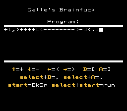
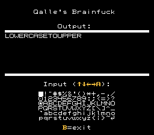

# Qalle's Brainfuck

A Brainfuck interpreter for the [NES](https://en.wikipedia.org/wiki/Nintendo_Entertainment_System). The actual size (including CHR data) is 2&nbsp;KiB.

Table of contents:
* [List of files](#list-of-files)
* [Features](#features)
* [How to use](#how-to-use)
* [Character set](#character-set)
* [References](#references)

## List of files
* `assemble.sh`: a Linux script that assembles the program (warning: deletes files)
* `bf.asm`: source code (assembles with [ASM6](https://www.romhacking.net/utilities/674/))
* `bf.nes.gz`: the assembled program (iNES format, gzip compressed)
* `examples.txt`: Brainfuck programs
* `hexdump.py`: a Python script that creates `hexdump.txt`
* `hexdump.txt`: the assembled program in hexadecimal (iNES header and unused ROM space omitted)
* `snap*.png`: screenshots

## Features
* maximum program size: 255 instructions
* Brainfuck RAM size: 1 KiB
* maximum output size: 256 bytes
* output speed: 1 character/frame

## How to use
There are two modes.

### Edit mode

* the program starts in this mode
* the cursor (blinking square) is always on the program input area
* note: the Brainfuck program won't run if brackets don't match

### Run mode

* there are three submodes:
  * if the cursor is on the output area: the Brainfuck program is running
  * if the cursor is on the virtual keyboard: the user is expected to enter a character
  * if the cursor is not visible: the Brainfuck program has finished or the maximum output size of 256 characters has been reached
* press B at any time to return to edit mode

## Character set
* output behavior:
  * byte `0x0a` moves the cursor to the start of the next line
  * other bytes advance the cursor by one
* output appearance:
  * bytes `0x20` to `0x7e`: as in ASCII
  * some bytes from `0x7f` on contain special characters
  * other bytes are blank
* input (virtual keyboard):
  * newline symbol (&#x21b5; at bottom right) inserts byte `0x0a`
  * other symbols insert bytes `0x20` to `0x7e`

## References
* [Wikipedia &ndash; Brainfuck](https://en.wikipedia.org/wiki/Brainfuck)
* [Esolang &ndash; Brainfuck](https://esolangs.org/wiki/Brainfuck)
* [NESDev Wiki](https://www.nesdev.org/wiki/)
